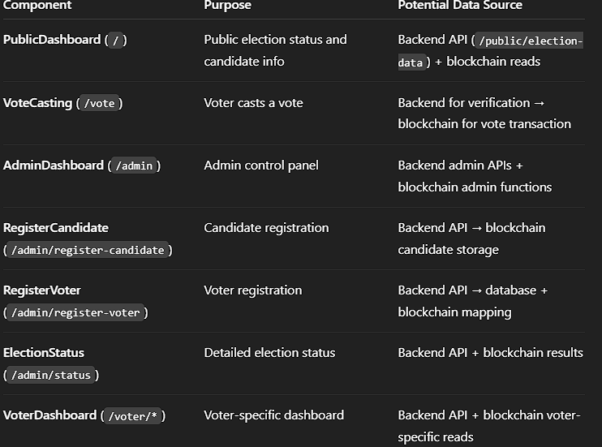

<<<<<<< HEAD
## Foundry

**Foundry is a blazing fast, portable and modular toolkit for Ethereum application development written in Rust.**

Foundry consists of:

-   **Forge**: Ethereum testing framework (like Truffle, Hardhat and DappTools).
-   **Cast**: Swiss army knife for interacting with EVM smart contracts, sending transactions and getting chain data.
-   **Anvil**: Local Ethereum node, akin to Ganache, Hardhat Network.
-   **Chisel**: Fast, utilitarian, and verbose solidity REPL.

## Documentation

https://book.getfoundry.sh/

## Usage

### Build

```shell
$ forge build
```

### Test

```shell
$ forge test
```

### Format

```shell
$ forge fmt
```

### Gas Snapshots

```shell
$ forge snapshot
```

### Anvil

```shell
$ anvil
```

### Deploy

```shell
$ forge script script/Counter.s.sol:CounterScript --rpc-url <your_rpc_url> --private-key <your_private_key>
```

### Cast

```shell
$ cast <subcommand>
```

### Help

```shell
$ forge --help
$ anvil --help
$ cast --help
```
=======
# VoteChain
>>>>>>> 9516111324571745f0da50ce418c29e730aa4c4f

# fig


# Here is a demo guideline of the full project:
```
Step 1: Requirements & Planning
Define Core Features:

Voter registration (with National ID, face ID, fingerprint)

Voter sign-in (biometric and National ID)

Ballot box for viewing candidates, casting, and confirming votes

Candidate registration (with biometric data and party information)

Public dashboard for observers and final election results

Decentralized storage for election data (smart contract on blockchain) combined with centralized server storage for non-critical data

User Roles:

Admin (Election Commission): Registers candidates and voters; ends election.

Voter: Registers, signs in using biometric authentication, and casts votes.

Observer/Public: Views candidates and election results.

Workflow & Navigation:

Landing page displays the public dashboard.

Prompt for wallet connection.

Once connected, redirect based on role (admin vs. voter).

Separate pages/dashboards for Admin and Voter functionality.

Step 3: Create the Multi-Page Structure
Routing:

Use React Router to create a multi-page setup.

Define routes for:

Landing/Public Dashboard (Home)

Admin Dashboard

Voter Dashboard

Ensure proper redirection after wallet connection based on user role.

File Organization:

Pages: e.g., HomePage.tsx, AdminPage.tsx, VoterPage.tsx

Components: Separate folders for admin, voter, and dashboard components.

Utils: Create a module for contract connection logic.

Styles: Global styles (and CSS modules if needed).

Step 4: Build the Public Dashboard (Landing Page)
Public Content:

Display election status and candidate list (read from the blockchain via your contract).

Wallet Connection:

Include a prompt/button to connect the wallet (using MetaMask).

Role Determination:

Once the wallet is connected, fetch the admin address from the smart contract.

Compare the connected address with the admin address.

Redirect the user to either the Admin Dashboard or Voter Dashboard accordingly.

Step 5: Build the Admin Interface
Admin Dashboard Components:

Candidate Registration: Form for the admin to enter candidate name and party details; calls the smart contract function.

Voter Registration: Form for registering a voter by their address.

Election Management: Component to end the election and view current election status.

Integration with Smart Contract:

Each admin action (registration, ending election) should trigger a transaction through ethers.js.

Security:

Restrict these functions to the admin’s wallet address by verifying against the smart contract’s stored admin address.

Step 6: Build the Voter Interface
Voter Dashboard Components:

Registration: Form for voters to register; this may include biometric data capture.

Biometric Authentication: Integrate modules or components for face and fingerprint recognition.

Vote Casting: Form or interface where the voter can view candidates and cast their vote.

Smart Contract Interaction:

For voting, ensure you check if the voter is registered and hasn’t already voted.

Biometric Integration:

Either integrate existing libraries for face/fingerprint capture or simulate biometric verification.

Ensure the biometric data is processed on the client and compared with stored values or hashes before sending transactions.

Step 7: Contract Integration & Testing
Smart Contract Connection:

Create a utility module (e.g., contract.ts) that connects to your deployed contract using ethers.js.

Define strong TypeScript interfaces for contract data.

Testing:

Test each component’s integration with the smart contract.

Use browser console logging and error boundaries to track issues.

Role-Based Redirection:

Ensure that the redirection logic (admin vs. voter) works seamlessly after wallet connection.

Step 8: Centralized Storage & Data Management
Central Server Integration:

For parts of your data (e.g., additional voter/candidate profiles, UI settings, analytics), plan to integrate REST or GraphQL APIs hosted on a centralized server.

Maintain the on-chain data for critical election functions while leveraging the centralized server for non-critical or heavy data.
```

## Here is a flowchart:
```
                    ┌─────────────────────────────────┐
                    │      User Visits Website        │
                    └─────────────┬───────────────────┘
                                  │
                                  ▼
                    ┌─────────────────────────────────┐
                    │   Public Dashboard (Landing)    │
                    │  - Election Status              │
                    │  - Candidate List               │
                    └─────────────┬───────────────────┘
                                  │
                                  ▼
                    ┌─────────────────────────────────┐
                    │  Prompt: Connect Wallet         │
                    └─────────────┬───────────────────┘
                                  │
                 ┌────────────────┴─────────────────┐
                 │ Wallet Connected?                │
                 └───────┬──────────────────────────┘
                         │ Yes
                         ▼
             ┌─────────────────────────────────┐
             │ Fetch Connected Wallet Address  │
             └─────────────┬───────────────────┘
                         │
                         ▼
             ┌─────────────────────────────────┐
             │  Get Admin Address from Contract │
             └─────────────┬───────────────────┘
                         │
                         ▼
         ┌──────────────┴─────────────┐
         │ Compare Wallet vs Admin    │
         │    (toLowerCase())         │
         └──────────────┬─────────────┘
                         │
          ┌──────────────┴─────────────┐
          │                            │
          ▼                            ▼
  ┌─────────────────┐        ┌────────────────────┐
  │  Admin Dashboard│        │  Voter Dashboard   │
  │  (Registration, │        │  (Registration,    │
  │   Election Mgt) │        │   Biometric Auth,  │
  │                 │        │   Vote Casting)    │
  └─────────────────┘        └────────────────────┘
                         │
                         ▼
          ┌─────────────────────────────────┐
          │    Observers & Public View      │
          │ (Election Results, Candidate    │
          │  Info, Voter Turnout, etc.)       │
          └─────────────────────────────────┘

```


# Data of App.tsx:




# Data Flow from PublicDashboard

```javascript
[User visits /] 
     ↓
React renders PublicDashboard
     ↓
useEffect triggers fetchPublicElectionData()
     ↓
GET http://localhost:5000/api/elections/public/election-data
     ↓
Backend (Express.js)
   → Reads candidate data from MongoDB
   → Optionally fetches live vote counts from Blockchain
   → Returns JSON { candidates[], ended, count }
     ↓
Frontend updates state & renders

```

```javascript
Frontend (PublicDashboard.tsx)
  ↓
GET /api/elections/public/election-data
  ↓
Express Route: router.get('/public/election-data', electionController.getElectionData)
  ↓
electionController.getElectionData()
  ↓
Blockchain (via getContract()):
    - electionEnded()
    - candidateCount()
    - getCandidates()
  ↓
Contract returns data → processed in JS → sent as JSON
  ↓
Frontend state updates & renders
```

# The data flow for role-checking

```javascript
WalletProvider (frontend)
  ↓
Reads connected wallet address from MetaMask
  ↓
Calls blockchain contract function (e.g., getRole(address))
  ↓
Sets global state: role = 'admin' | 'voter'
  ↓
Dashboards use role to decide UI and routes

```


# Data flow at login

```javascript
[User clicks Connect Wallet]
       ↓
MetaMask pops up
       ↓
frontend/wallet-provider.tsx:
  - eth_requestAccounts → signer
  - createContract(signer)
  - electionCommission() → admin address
  - Compare with connected wallet
       ↓
If match → /admin
Else     → /voter

```


# Cadidate Registration Flow

```javascript
Admin (RegisterCandidate.tsx)
    │
    ├─ FaceCapture → POST /api/candidates/train-face/:nid → MongoDB (face embeddings)
    │
    ├─ GET /api/candidates/face-hash/:nid → Face hash (from MongoDB)
    │
    ├─ Blockchain: registerCandidate(name, NID, location, faceHash)
    │
    └─ POST /api/candidates/register → MongoDB (full profile + blockchainId)


  const tx = await registerCandidate(
  formData.name,         // Candidate full name
  formData.nationalId,   // NID (10-digit string)
  formData.location,     // Constituency or area
  faceHash               // SHA-256 hash of face images
)


```


```javascript
Admin (Frontend: RegisterCandidate.tsx)
    |
    |---[1] FaceCapture component--->
    |    POST /api/candidates/train-face/:nid
    |    -------------------------------------
    |    Backend:
    |       - Stores captured face images
    |       - Runs ML training
    |       - Saves embeddings in MongoDB
    |    -------------------------------------
    |<--- 200 OK (Face trained)
    |
    |---[2] GET /api/candidates/face-hash/:nid--->
    |    ----------------------------------------
    |    Backend:
    |       - Reads stored face images
    |       - Generates SHA-256 faceHash
    |    ----------------------------------------
    |<--- faceHash (string)
    |
    |---[3] registerCandidate(name, NID, location, faceHash) --->
    |    -------------------------------------------------------
    |    Blockchain (Smart Contract):
    |       - Stores candidate { id, name, NID, location, faceHash, voteCount=0, isVerified=false }
    |       - Emits CandidateRegistered event
    |    -------------------------------------------------------
    |<--- Transaction receipt (tx.hash)
    |
    |---[4] POST /api/candidates/register--->
    |    Body:
    |       - name, party, NID, fathersName, mothersName, DOB,
    |         bloodGroup, postOffice, postCode, location,
    |         faceId (regenerated in backend),
    |         fingerprint (SHA256 placeholder),
    |         blockchainId = tx.hash
    |    ------------------------------------
    |    Backend:
    |       - Saves full candidate profile in MongoDB
    |       - Adds timestamps, verification status
    |    ------------------------------------
    |<--- 201 Created (Candidate saved)
    |
[Frontend navigates back to /admin dashboard]

```


# End to End flow: Face Registration(Voter/ Candidate)

```javascript
sequenceDiagram
    autonumber
    participant FE as Frontend (FaceCapture.tsx)
    participant BR as Backend Routes (biometricRoutes.js)
    participant PY as Python Script (dataset.py)
    participant FS as File System (/dataset/<NID>)
    participant HF as Backend Face Hash API (/face-hash/:nid)
    participant TF as Train Face API (/train-face/:nid)
    participant PYTF as Python Script (train_faces.py)
    participant BC as Blockchain (Smart Contract)
    participant DB as MongoDB (Central DB)

    Note over FE: User clicks "Start Capture"

    FE->>BR: POST /api/biometric/capture-face {nid}
    BR->>PY: spawn("python dataset.py <nid>")
    PY->>PY: Open webcam, load InsightFace model
    PY->>PY: Loop until 10 images captured<br/>Check face bbox + diff_thresh
    PY->>FS: Save annotated face images<br/>(<nid>_1.jpg ... <nid>_10.jpg)
    PY->>BR: stdout logs ("Saved 1/10...", etc.)
    PY-->>BR: Exit code 0 (success)

    BR-->>FE: { success:true, output:"Saved 1/10..." }

    FE->>HF: GET /api/{voters|candidates}/face-hash/:nid
    HF->>FS: Read all images for <nid>
    HF->>HF: Compute SHA256 hash of concatenated image bytes
    HF-->>FE: { faceHash: "<64-char-hex>" }

    FE->>TF: POST /api/{voters|candidates}/train-face/:nid
    TF->>PYTF: spawn("python train_faces.py")
    PYTF->>FS: Load images for all IDs in dataset/
    PYTF->>PYTF: Extract embeddings with InsightFace
    PYTF->>PYTF: Update or retrain SGDClassifier
    PYTF->>FS: Save model (face_encodings.pkl)
    PYTF-->>TF: Training done
    TF-->>FE: { success:true }

    Note over FE: After biometric ready, Admin clicks "Register Voter/Candidate"

    FE->>BC: registerVoter(name, nid, location, faceHash)
    BC-->>FE: blockchainId

    FE->>DB: POST /api/{voters|candidates}/register
    DB->>DB: Store all personal info + faceId (hash) + blockchainId
    DB-->>FE: { success:true }

    Note over FE: Registration complete on both blockchain & DB

```


## Previous Development Repository
Earlier development history and contributions can be found here:
https://github.com/rifat87/VoteChain
